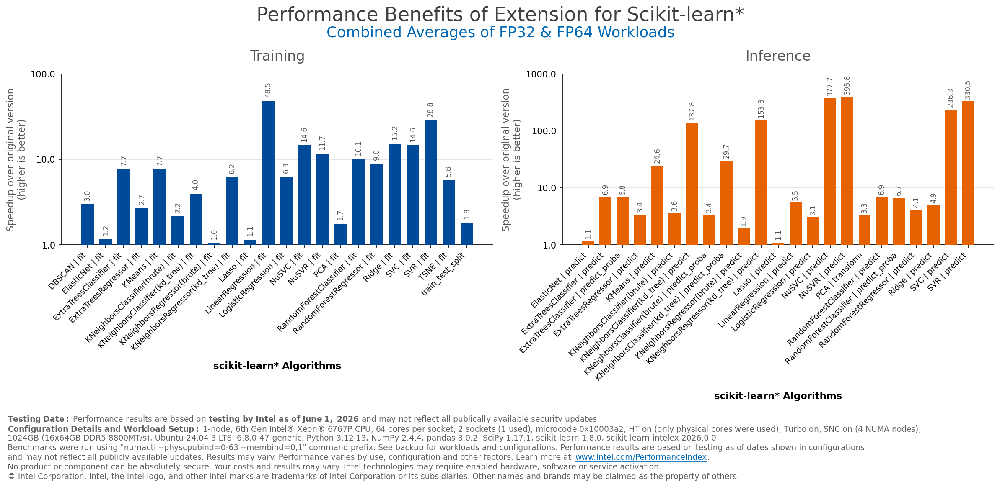

.. Copyright 2020 Intel Corporation
..
.. Licensed under the Apache License, Version 2.0 (the "License");
.. you may not use this file except in compliance with the License.
.. You may obtain a copy of the License at
..
..     http://www.apache.org/licenses/LICENSE-2.0
..
.. Unless required by applicable law or agreed to in writing, software
.. distributed under the License is distributed on an "AS IS" BASIS,
.. WITHOUT WARRANTIES OR CONDITIONS OF ANY KIND, either express or implied.
.. See the License for the specific language governing permissions and
.. limitations under the License.

.. include:: substitutions.rst

.. toctree::
   :caption: Getting Started
   :hidden:
   :maxdepth: 3

   Quick Start <self>
   installation.rst
   about.rst

.. toctree::
   :caption: Documentation topics
   :hidden:
   :maxdepth: 4

   patching.rst
   algorithms.rst
   oneapi-gpu.rst
   config-contexts.rst
   array_api.rst
   serialization.rst
   distributed-mode.rst
   distributed_daal4py.rst
   non-scikit-algorithms.rst
   non_sklearn_d4p.rst
   model_builders.rst
   logistic_model_builder.rst
   input-types.rst
   verbose.rst
   parallelism.rst
   preview.rst
   deprecation.rst

.. toctree::
   :caption: daal4py
   :hidden:

   about_daal4py.rst
   daal4py.rst

.. toctree::
   :caption: Development guides
   :hidden:

   building-from-source.rst
   tests.rst
   contribute.rst
   contributor-reference.rst
   ideas.rst

.. toctree::
   :caption: Performance
   :hidden:
   :maxdepth: 2

   guide/acceleration.rst

.. toctree::
   :caption: Learn
   :hidden:
   :maxdepth: 2

   Tutorials & Case Studies <tutorials.rst>
   Medium Blogs <blogs.rst>

.. toctree::
   :caption: More
   :hidden:
   :maxdepth: 2

   support.rst
   code-of-conduct.rst
   license.rst

.. toctree::
   :caption: Examples
   :hidden:
   :maxdepth: 3

   samples.rst
   kaggle.rst

.. _index:

Introduction
============

|sklearnex| is a **free software AI accelerator** designed to deliver up to **100X** faster performance for your existing |sklearn| code.
The software acceleration is achieved with vector instructions, AI hardware-specific memory optimizations, threading, and optimizations.

Benefits:

* Speed up training and inference by up to 100x with equivalent mathematical accuracy.
* Benefit from performance improvements across different hardware configurations, including :doc:`GPUs <oneapi-gpu>` and :doc:`multi-GPU <distributed-mode>` configurations.
* Integrate the extension into your existing |sklearn| applications without code modifications.
* Continue to use the open-source |sklearn| API.
* Enable and disable the extension with a couple of lines of code or at the command line.

(`Benchmarks code <https://github.com/IntelPython/scikit-learn_bench>`__)

See :doc:`about` for more information.

Quick Install
=============

.. tabs::

    .. tab:: From PyPI

        .. code-block::

            pip install scikit-learn-intelex

    .. tab:: From conda-forge

        .. code-block::

            conda install -c conda-forge scikit-learn-intelex --override-channels

See the full :doc:`installation` for more details.

Example Usage
=============

.. tabs::
   .. tab:: By patching
      .. code-block:: python

         import numpy as np
         from sklearnex import patch_sklearn
         patch_sklearn()

         from sklearn.cluster import DBSCAN

         X = np.array([[1., 2.], [2., 2.], [2., 3.],
                       [8., 7.], [8., 8.], [25., 80.]], dtype=np.float32)
         clustering = DBSCAN(eps=3, min_samples=2).fit(X)

      See :doc:`patching` for more details.

   .. tab:: Without patching
      .. code-block:: python

         import numpy as np
         from sklearnex.cluster import DBSCAN

         X = np.array([[1., 2.], [2., 2.], [2., 3.],
                       [8., 7.], [8., 8.], [25., 80.]], dtype=np.float32)
         clustering = DBSCAN(eps=3, min_samples=2).fit(X)

Running on GPUs
===============

Note: executing on GPU has `additional system software requirements <https://www.intel.com/content/www/us/en/developer/articles/system-requirements/intel-oneapi-dpcpp-system-requirements.html>`__ - see :doc:`oneapi-gpu`.

.. tabs::
   .. tab:: By patching
      .. tabs::
         .. tab:: By moving data to device
            .. code-block:: python

               import numpy as np
               from sklearnex import patch_sklearn, config_context
               patch_sklearn()

               from sklearn.cluster import DBSCAN

               X = np.array([[1., 2.], [2., 2.], [2., 3.],
                             [8., 7.], [8., 8.], [25., 80.]], dtype=np.float32)
               with config_context(target_offload="gpu:0"):
                   clustering = DBSCAN(eps=3, min_samples=2).fit(X)

         .. tab:: With GPU arrays
            .. code-block:: python

               import os
               os.environ["SCIPY_ARRAY_API"] = "1"
               import numpy as np
               import torch
               from sklearnex import patch_sklearn
               patch_sklearn()
               from sklearn import config_context

               from sklearn.cluster import DBSCAN

               X = np.array([[1., 2.], [2., 2.], [2., 3.],
                             [8., 7.], [8., 8.], [25., 80.]], dtype=np.float32)
               X = torch.tensor(X, device="xpu")
               with config_context(array_api_dispatch=True):
                   clustering = DBSCAN(eps=3, min_samples=2).fit(X)

   .. tab:: Without patching
      .. tabs::
         .. tab:: By moving data to device
            .. code-block:: python

               import numpy as np
               from sklearnex import config_context
               from sklearnex.cluster import DBSCAN

               X = np.array([[1., 2.], [2., 2.], [2., 3.],
                             [8., 7.], [8., 8.], [25., 80.]], dtype=np.float32)
               with config_context(target_offload="gpu:0"):
                  clustering = DBSCAN(eps=3, min_samples=2).fit(X)

         .. tab:: With GPU arrays
            .. code-block:: python

               import os
               os.environ["SCIPY_ARRAY_API"] = "1"
               import numpy as np
               import torch
               from sklearnex import config_context
               from sklearnex.cluster import DBSCAN

               X = np.array([[1., 2.], [2., 2.], [2., 3.],
                             [8., 7.], [8., 8.], [25., 80.]], dtype=np.float32)
               X = torch.tensor(X, device="xpu")
               with config_context(array_api_dispatch=True):
                   clustering = DBSCAN(eps=3, min_samples=2).fit(X)

See :ref:`oneapi_gpu` for other ways of executing on GPU.
